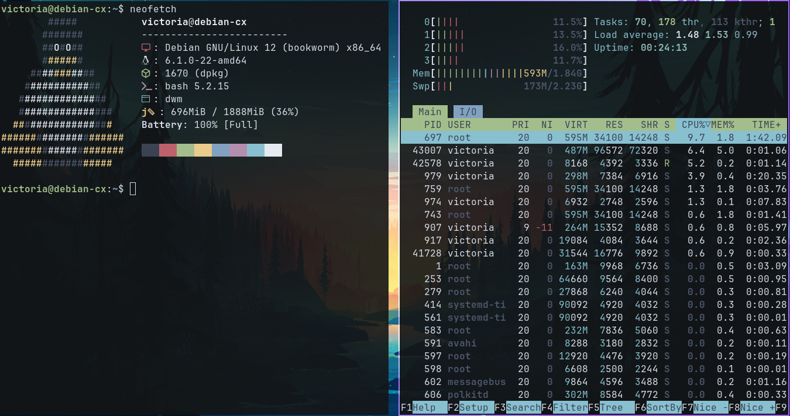

# My custom build of st(simple terminal)



## How to install

First, clone the repository

```bash
git clone https://github.com/Ferchupessoadev/st.git
```

use `sudo make install clean` to compiler the program

```bash
cd st
sudo make install clean
```

## Patches

- [alpha](https://st.suckless.org/patches/alpha/st-alpha-20220206-0.8.5.diff)

- [blinking cursor](https://st.suckless.org/patches/blinking_cursor/st-blinking_cursor-20230819-3a6d6d7.diff)

- [scrollback](https://st.suckless.org/patches/scrollback/st-scrollback-0.8.5.diff)

- [nordtheme](https://st.suckless.org/patches/nordtheme/st-nordtheme-0.8.5.diff)

- [universcroll](https://st.suckless.org/patches/universcroll/st-universcroll-0.8.4.diff)

- [universcroll-example](https://st.suckless.org/patches/universcroll/st-universcroll-example-0.8.4.diff)

- [openclipboard](https://st.suckless.org/patches/open_copied_url/st-openclipboard-20220217-0.8.5.diff)

In the patch nordtheme I made a change to the config.h file
